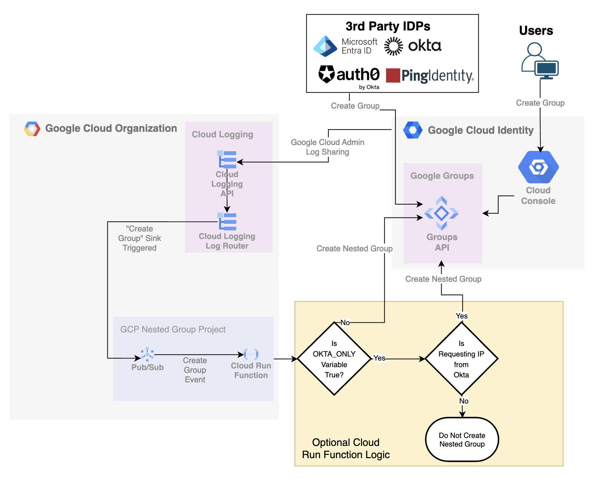
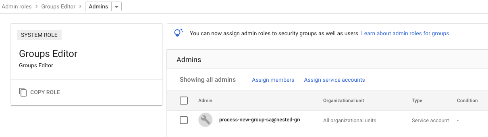
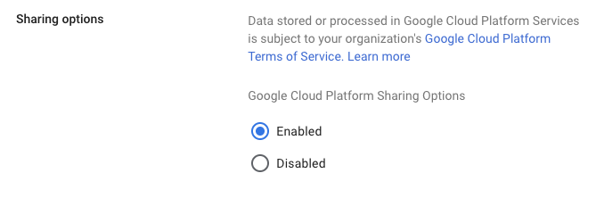

# Google Cloud Nested Groups from External IDPs

## Overview
This project demonstrates a solution for triggering nested groups in Google Cloud when your primary Identity Provider (IDP) doesn't natively support nested group structures. Many organizations rely on external IDPs for user and group management. However, these IDPs sometimes lack the ability to define or sync nested groups, which can be crucial for fine-grained access control in cloud environments.

This project demonstrates an option to bridge that gap by providing a mechanism to automatically create a nested group structure within Google Cloud based on "google.admin.AdminService.createGroup" logging events.


## Problem
External Identity Providers (IDPs) are commonly used for managing users and groups. However, a limitation of some IDPs is the lack of support for nested groups. This can create challenges when trying to implement granular access control within Google Cloud, where nested groups are a powerful feature. One example of their use is how nested Google Groups can be used under the "gke-security-groups" group when working with [GKE RBAC](https://cloud.google.com/kubernetes-engine/docs/how-to/google-groups-rbac#setup-group).

### Architecture

### Prerequisites
* A Google Cloud project
* A billing account linked to your project
* The `gcloud` CLI installed and configured
* The group set as $PARENT_GROUP below exists in Google Cloud Identity (gke-security-groups in my example)

### Steps
1. **Set Variables:** Set all project variables, if PROJECT_ID is set, new project setup will be skipped.
1. **Create Project (Optional):** The provided script will create a new project if one does not already exist.
1. **Enable APIs:** Enable the required Google Cloud APIs (Cloud Functions, Cloud Build, Eventarc, Cloud Identity, etc.).
1. **Create Log Sink to Pub/Sub Topic:** Create an organization-level log sink that filters for group creation events and forwards them to the Pub/Sub topic.
1. **Create Cloud Run Service Account:** Create a service account for the Cloud Run function with the necessary permissions.
1. **Deploy Cloud Run Function:** Deploy the Cloud Run function, configuring it to subscribe to the Pub/Sub topic.
1. **Configure Admin Log Sharing:** Ensure that group creation events from  Google Cloud Admin are being shared with Google Cloud.

### Set Variables
```bash
export PROJECT_ID=
export PROJECT_NAME= #Only needed if PROJECT_ID is not set
export BILLING_ACCOUNT= #Only needed if PROJECT_ID is not set
export ORGANIZATION_ID=
export REGION= #For Cloud Run Function e.g. us-central1
export SINK_NAME='new-group-events-sink'
export TOPIC_ID='new-group-events-topic'
export CLOUD_RUN_SERVICE="process-new-group"
export PARENT_GROUP= #e.g. gke-security-groups@domain
export OKTA_ONLY="False" #"True" will check IPs against Okta's published list
```

### Setup Nested Groups Project If Needed (Optional)
```bash
if [ -z "${PROJECT_ID}" ]
then
  PROJECT=$(gcloud projects list --filter=name:${PROJECT_NAME})
  if [ -z "${PROJECT}" ]
  then
    RANDOM_PROJECT_SUFFIX=$(cat /dev/urandom | tr -dc 'a-z0-9' | fold -w 6 | head -n 1)
    printf 'Y' | gcloud projects create ${PROJECT_NAME}-${RANDOM_PROJECT_SUFFIX} --name=${PROJECT_NAME} --organization=${ORGANIZATION_ID}
    while [[ -z "${EXISTS}" ]]; do
      EXISTS=$(gcloud projects list --filter=name:${PROJECT_NAME} --format 'value(PROJECT_ID)')
      sleep 1
    done
  fi
  export PROJECT_ID=$(gcloud projects list --filter=name:${PROJECT_NAME} --format 'value(PROJECT_ID)')
  gcloud beta billing projects link ${PROJECT_ID} --billing-account=${BILLING_ACCOUNT}  
fi
export PROJECT_NUMBER=$(gcloud projects list --filter=name:${PROJECT_NAME} --format 'value(PROJECT_NUMBER)')

gcloud config set project ${PROJECT_ID}
gcloud auth application-default set-quota-project ${PROJECT_ID}
```

### Enable APIs
```bash
printf 'y' |  gcloud services enable cloudfunctions.googleapis.com
printf 'y' |  gcloud services enable cloudbuild.googleapis.com
printf 'y' |  gcloud services enable eventarc.googleapis.com
printf 'y' |  gcloud services enable cloudidentity.googleapis.com
printf 'y' |  gcloud services enable run.googleapis.com
```

### Create Org-level Log Sink to Pub/Sub Topic
```bash
gcloud pubsub topics create $TOPIC_ID

gcloud logging sinks create $SINK_NAME \
  pubsub.googleapis.com/projects/${PROJECT_ID}/topics/${TOPIC_ID} \
  --organization=$ORGANIZATION_ID \
  --log-filter="protoPayload.methodName="google.admin.AdminService.createGroup" AND resource.labels.service="admin.googleapis.com""

gcloud pubsub topics add-iam-policy-binding $TOPIC_ID \
--member=serviceAccount:service-org-${ORGANIZATION_ID}@gcp-sa-logging.iam.gserviceaccount.com \
--role='roles/pubsub.publisher'
```

### Create Cloud Run Service Account
```bash
gcloud iam service-accounts create ${CLOUD_RUN_SERVICE}-sa \
    --display-name "Cloud Run Group Membership Modifier"
```
Once this user-created Cloud Run service account is available, you'll need to grant this service account permissions to modify group membership in Google Cloud Admin. Detailed steps are available on [this page](https://support.google.com/a/answer/9807615?hl=en#zippy=%2Cassign-a-role-to-a-service-account), including how to create a custom role if you want something slightly less permissioned than "Groups Editor" as shown below.
- Navigate to your [Google Cloud Admin Roles page] (https://admin.google.com/ac/roles)
- Select "Groups Editor"
- Select "Admins Assigned"
- Select "Assign Service Accounts"
- Add your service account to this page and save; In the above steps, mine is ${CLOUD_RUN_SERVICE}-sa.



### Deploy Cloud Run Function with Pub/Sub Subscription
```bash 
gcloud projects add-iam-policy-binding ${PROJECT_ID} \
    --member=serviceAccount:${PROJECT_NUMBER}-compute@developer.gserviceaccount.com \
    --role=roles/cloudbuild.builds.builder

gcloud functions deploy ${CLOUD_RUN_SERVICE} \
  --gen2 \
  --project=${PROJECT_ID} \
  --region=${REGION} \
  --runtime=python312 \
  --entry-point=index \
  --trigger-topic=${TOPIC_ID} \
  --ingress-settings=internal-only \
  --allow-unauthenticated \
  --service-account=${CLOUD_RUN_SERVICE}-sa@${PROJECT_ID}.iam.gserviceaccount.com \
  --set-env-vars "PARENT_GROUP=${PARENT_GROUP}" \
  --set-env-vars "OKTA_GROUPS_ONLY=${OKTA_ONLY}" \
  --source=./src
```

### Configure Admin Log Sharing
In order to trigger the above workflow based on log entries in Google Cloud, you need to ensure that log entries from your Google Admin Console are shared with your organization’s Google Cloud account. After that is complete, you can access the shared data through the Google Cloud Log Explorer
- [Detailed directions](https://support.google.com/a/answer/9320190) are available and a screenshot of this option is shown below



## Usage
Once deployed, the system will automatically monitor for new group creation log events. When a new group creation log event is delivered, the log sink will capture the event, the Pub/Sub topic will receive it, and the Cloud Run function will update the group membership in Google Cloud. 
- If the OKTA_ONLY environment variable is set to "True" only new group creation logs coming from Okta servers, [based on Okta's published IP addresses](https://help.okta.com/en-us/content/topics/security/ip-address-allow-listing.htm), will be nested under the PARENT_GROUP. This example is highlighted in the architecture above.
- If there is a naming convention for groups which should be nested under the PARENT_GROUP, you can edit the log filter query in Step 4, or adjust the code in src/main.py accordingly.

### Clean up (Remove Project)
```bash
printf 'y' |  gcloud projects delete ${PROJECT_ID}
```

***

**Disclaimer:** This is not an official Google product.